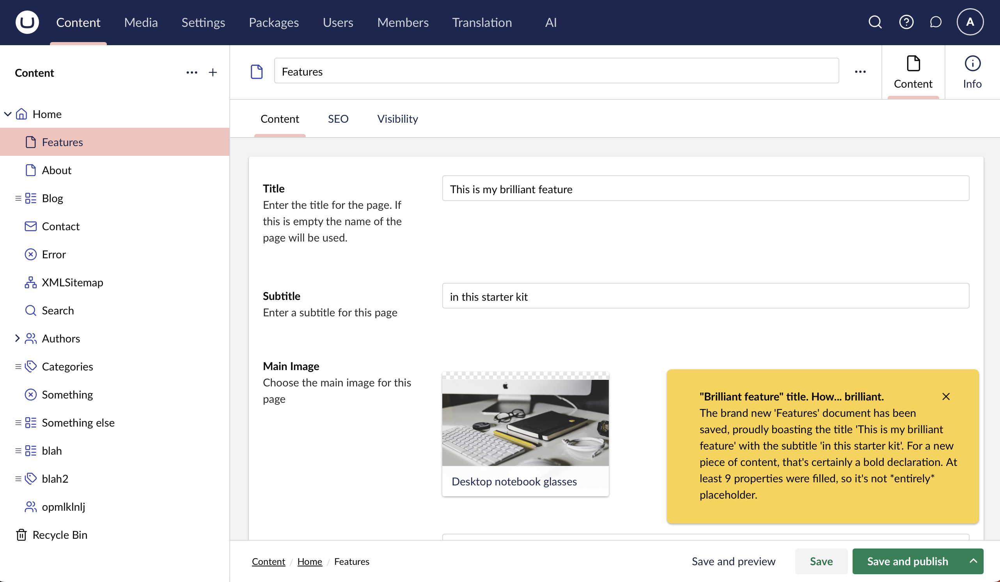
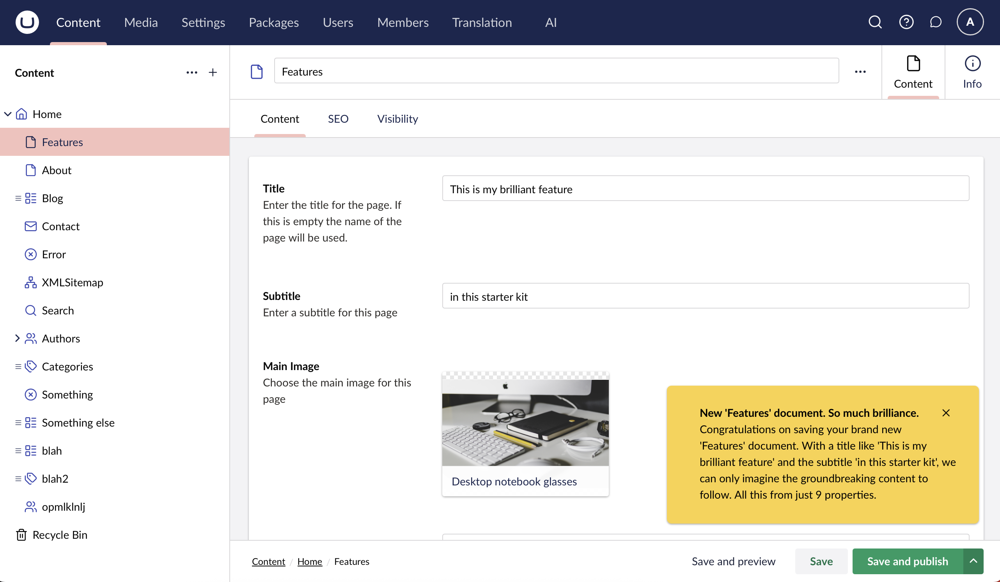
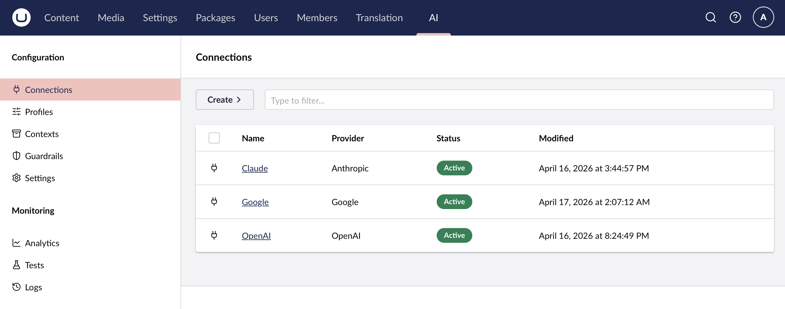
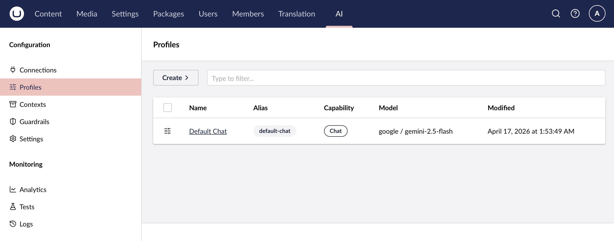
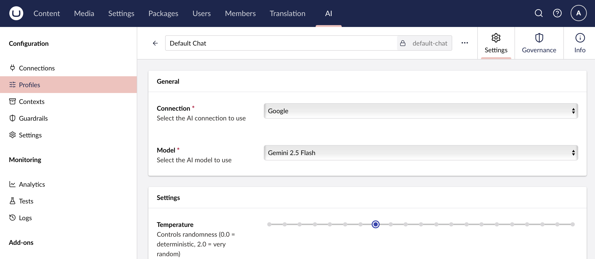
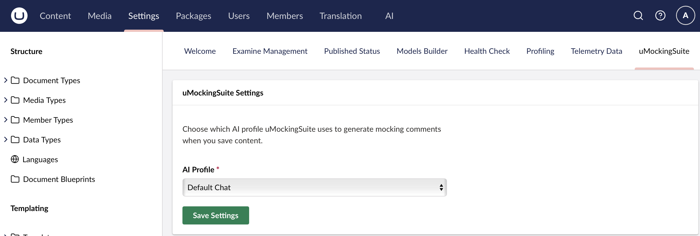

# uMockingSuite

> Because every content save deserves snarky, AI-powered commentary

[](https://www.nuget.org/packages/uMockingSuite)
[](https://umbraco.com)
[](LICENSE)

## The Package in Action

Every content save gets a unique, context-aware AI critique. Here are two examples of uMockingSuite in the wild:





### Getting Started

To use uMockingSuite, you'll need to set up a few things in the Umbraco AI package first:

Configure the provider you want in the Umbraco AI feature



And a profile that uses that provider



Mess around with settings and guard rails



Then attach it to uMockingSuite simply in settings



You are good to go, prepare to me lightly but cruely lambasted as you go about your business in the back office.

## About

uMockingSuite was built at the **Manchester Umbraco AI Hackathon** as a demonstration of how easy it is to get started with the Umbraco AI package. When a content editor saves content in the Umbraco 17 backoffice, uMockingSuite intercepts the event, sends the content details to your configured AI provider (Claude, OpenAI, Google, etc.), and displays a short, witty, passive-aggressive toast notification critiquing their work.

This is **not** a production-hardened tool—it's a hackathon/learning project and study vehicle for developers who want to learn how to add AI features to their own Umbraco projects. Every extension point, API endpoint, and integration pattern is intentionally simple and well-documented.

Looking ahead, uMockingSuite is the prototype for **disengage**, a more refined package that will bring personality-driven AI commentary to the Umbraco ecosystem. Watch this space.

## Features

- ✨ **AI-powered notifications** — Witty, snarky comments generated by your chosen AI provider
- 🎯 **Seamless backoffice integration** — Fires on every content save using Umbraco 17's `workspaceContext` extension
- ⚙️ **Configurable AI profiles** — Choose which Umbraco AI profile to use via the Settings dashboard
- 🔌 **Provider-agnostic** — Works with any AI provider configured in Umbraco AI (Claude, OpenAI, Google, etc.)
- 🛡️ **Graceful fallbacks** — If AI service is unavailable, falls back to deterministic snarky messages

## Requirements

- **Umbraco:** 17.x
- **.NET:** 10.0
- **Umbraco AI package:** Any AI provider configured (Claude, OpenAI, Google, etc.)

## Installation

### NuGet

```bash
dotnet add package uMockingSuite
```

Or via NuGet Package Manager:

```powershell
Install-Package uMockingSuite
```

## Configuration

### Step 1: Install Umbraco AI

uMockingSuite depends on the **Umbraco AI package** to generate mocking comments. If you haven't already:

1. Install the Umbraco AI package
2. Configure at least one AI provider (Claude, OpenAI, Google, etc.)
3. Set up a chat profile in your Umbraco backoffice

👉 [Umbraco AI Documentation](https://github.com/umbraco/Umbraco.AI)

### Step 2: Configure Your AI Profile

1. Navigate to **Settings** → **uMockingSuite** in the Umbraco backoffice
2. Select which AI profile to use for generating mocking comments
3. Click **Save Settings**

That's it! Now every time you save content, you'll get a snarky AI-generated notification.

## How It Works

uMockingSuite demonstrates several key Umbraco 17 extension points:

1. **workspaceContext Extension** — Intercepts the document save flow by wrapping `requestSubmit` on the `UmbDocumentWorkspaceContext`, allowing it to fire after content is successfully saved.
2. **Management API** — Exposes `/umbraco/management/api/v1/umockingsuite/mocking-message` to generate comments, `/profiles` to list available AI profiles, and `/settings` to persist configuration.
3. **Umbraco AI Integration** — Uses `IAIChatService` with the inline builder API (`builder.WithAlias(profileAlias)`) to call any configured AI provider.
4. **Dashboard UI** — A Lit-based settings dashboard in the Settings section for profile selection.

All client-side code is vanilla JavaScript (no build step required). The package manifest at `uMockingSuite/App_Plugins/uMockingSuite/umbraco-package.json` registers both the workspace context and the dashboard.

## Development / Contributing

Want to run uMockingSuite locally or contribute?

### Prerequisites

- .NET 10 SDK
- Umbraco 17.x
- Umbraco AI package installed and configured

### Running the Demo Site

```bash
cd Umbraco.AI.Demo
dotnet run
```

The demo site references uMockingSuite via a `ProjectReference`, so changes to the package are reflected immediately. An MSBuild target in `uMockingSuite/uMockingSuite.csproj` automatically copies `App_Plugins` assets to the host site's output directory on build.

### Project Structure

```
uMockingSuite/
├── uMockingSuite.csproj          # Package class library (.NET 10, Umbraco 17)
├── Composers/                     # Umbraco composers for DI registration
├── Controllers/                   # Management API endpoints
├── Notifications/                 # Content save notification handlers
├── Services/                      # Mocking service with AI integration
└── App_Plugins/uMockingSuite/     # Backoffice package manifest + UI
    ├── umbraco-package.json       # Package manifest
    ├── umockingsuite-workspace-context.js  # Save interception
    └── umockingsuite-settings.js  # Settings dashboard UI
```

### Testing

```bash
cd uMockingSuite.Tests
dotnet test
```

The test suite uses **xUnit**, **Moq**, and **FluentAssertions** to validate notification handling and AI service integration. 19 tests covering edge cases, fallback behavior, and batch content saves.

### Contributing

This is a hackathon project that welcomes community contributions! Whether you want to:

- Add new AI personalities or prompts
- Improve the UI
- Add configuration options
- Fix bugs or add tests

Please feel free to open an issue or submit a pull request. Keep the tone friendly, the code simple, and the tests passing.

## Hackathon Context

uMockingSuite was born at the **Manchester Umbraco AI Hackathon** to show just how easy it is to integrate AI into Umbraco workflows. The entire package—from backoffice UI to AI service integration—was built to be:

- **Easy to understand** for developers new to Umbraco 17 or AI integration
- **Well-structured** as a reference implementation
- **Fun to use** because who doesn't want a snarky AI judging their content?

The hackathon spirit lives on in this codebase. If you're learning Umbraco 17 extension development or exploring AI integration patterns, fork this repo and make it your own. The community wins when we share knowledge openly.

**Meta note:** This is an AI package about AI, and it was built entirely by an AI team—there's a delightful absurdity to that. Learn more in the [Built with Squad](#built-with-squad) section below.

## What's Next — disengage

uMockingSuite is the prototype. **disengage** is the evolution.

We're planning to expand this concept into a more refined package with:

- Multiple AI personalities (snarky, encouraging, poetic, etc.)
- Configurable trigger conditions (save, publish, specific content types)
- Rich notification formats (cards, expandable details, links to content guidelines)
- Integration with content workflows and approval processes

If you want to be part of disengage's development, star this repo and watch for updates. Or better yet, contribute to uMockingSuite and help shape what comes next.

## Built with Squad

Yes, really. This package—which mocks your content with AI—was built entirely by an AI team.

uMockingSuite was orchestrated with [Squad](https://github.com/bradygaster/squad), an AI team system for GitHub Copilot. Each agent has a persistent memory, a charter, and a decision log—which, ironically, is more structured governance than most actual software teams manage. Squad cast this project's team from UK Prime Ministers:

| Name | Role |
|------|------|
| Boris | Lead & Architect |
| Rishi | Umbraco Specialist |
| Theresa | Frontend Expert |
| Tony | Backend Dev |
| Gordon | Tester/QA |
| John | DevRel & Release Engineer |

The Westminster roster is part of Squad's personality—it assigns fictional universes to agent teams. That said, Boris, Rishi, Theresa, Tony, Gordon, and John proved considerably more reliable at shipping features than their namesakes ever were at, well, anything.

The beauty of this setup is that each agent maintains context, hands off work with precision, and actually completes tasks. Revolutionary, really. You can see the full team charters and decision logs in [`.squad/`](.squad/).

## License

MIT © 2026 Jonny Muir

Built with love and snark at the Manchester Umbraco AI Hackathon
